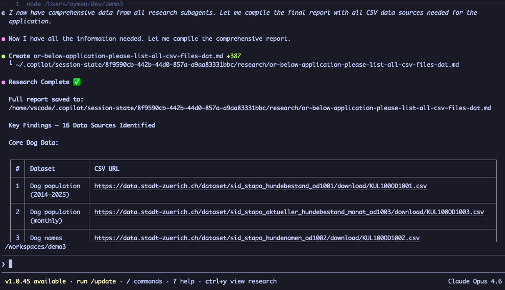
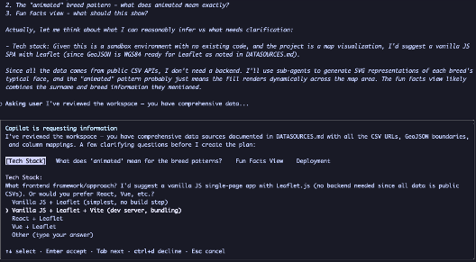
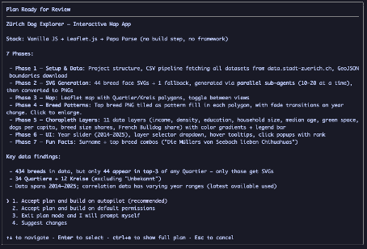

# How I Work With AI Coding Agents

Most people open a chat, type "build me X," and hope for the best. That works for small stuff. For anything real, you need a process.

I use five phases. They're not complicated, but skipping any of them costs me time. Here's what that looks like in practice, using a recent project as an example.

> **Live demo:** The sample project built with this workflow is deployed at [aymenfurter.github.io/dog-map](https://aymenfurter.github.io/dog-map/).

## The Phases

### 1. Braindump

I dump everything in my head into a file. Stream of consciousness. What I want, why, half-baked ideas, edge cases I'm already worried about. No structure, no editing.

The agent can't read my mind. This file is the closest substitute.

### 2. Research

Before anyone writes code, I collect the facts. API endpoints, data schemas, library docs, whatever the project depends on. The agent helps here -- I point it at data sources and it goes digging.

In this project, I had the agent spin up research subagents to track down all the CSV datasets from Zurich's open data portal. It came back with 16 data sources, URLs and all.

The point: stop the agent from making things up about APIs that don't exist or libraries that work differently than it thinks.

### 3. Plan

I brainstorm with the agent. We break the braindump into tasks, pick an architecture, sequence the work. The agent proposes, I push back, we iterate.

The agent asks clarifying questions -- what did I mean by "animated" patterns? What should the fun facts view actually show? I answer, it refines.

Then it puts together a full plan with phases, tech stack decisions, and key data findings. I accept it, modify it, or scrap it before a single line of code gets written.

No code yet. Just a plan we both agree on.

### 4. Implement

The agent writes code. I review after each chunk, not at the end. If something is off, I say so immediately.

Small iterations. Fast feedback. The worst outcome is letting the agent run for 20 minutes unsupervised and then discovering it went in the wrong direction.

### 5. Next Session

At the end of a session, I write a short summary: what got done, what's left, any decisions or blockers. This becomes the starting context for the next conversation.

Without it, every session starts cold. The agent has zero memory between conversations, so this handoff doc is the only continuity you get.

## Tactics

The phases are the structure. These habits make each phase sharper.

**Ground the agent in real docs.** I use MS Learn MCP so the agent pulls from current documentation instead of relying on training data. When it cites an API, I want it citing the real one.

**Sandbox execution.** Everything runs in a devcontainer. The agent can install packages, run scripts, break things -- none of it touches my machine.

**Review working code, not just diffs.** I ask the agent to write e2e tests alongside features. If the test passes, I trust the code more. Linting and security scanning happen automatically (DevSecOps), so by the time I look at it, the obvious stuff is already caught. Optimize for review throughput, not PR count.

**Ask for variants.** Instead of accepting the first solution: "Redesign this app, give me 5 options." Seeing multiple approaches side by side is faster than iterating on one.

**Spawn subagents for parallel exploration.** Same prompt, taken further: "Give me 5 options, spawn subagents for each." Each variant gets deep exploration simultaneously.

**Mix models.** For important decisions: "Give me 5 options, spawn subagents for each, one with Claude, one with Gemini, one with GPT." Different models, different blind spots.

**Use skills for repetitive work.** Anything I do more than twice becomes a skill -- OTel instrumentation, test scaffolding, deployment configs. Front-load the instructions once, reuse forever.

**Keep context healthy.** Stale context is worse than no context. Keep context files lean, remove outdated notes, don't dump the entire codebase into the conversation.

## License

MIT
